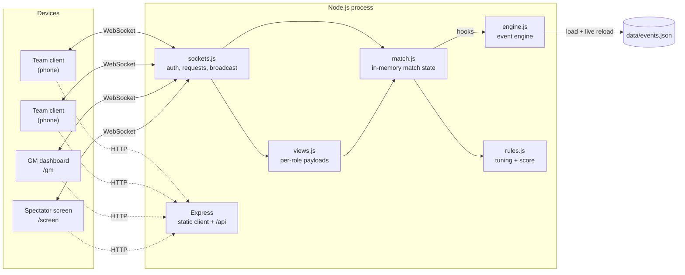
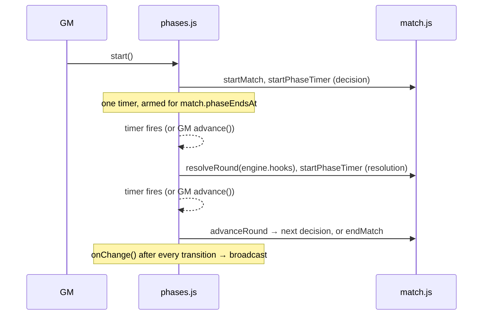
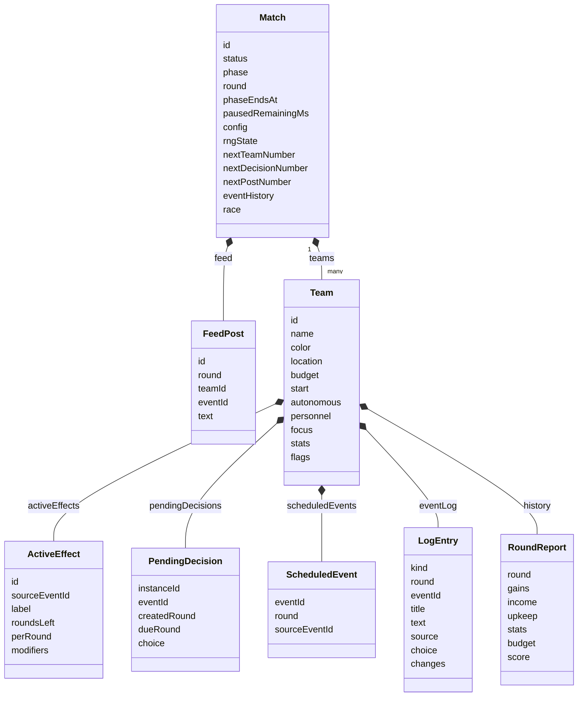
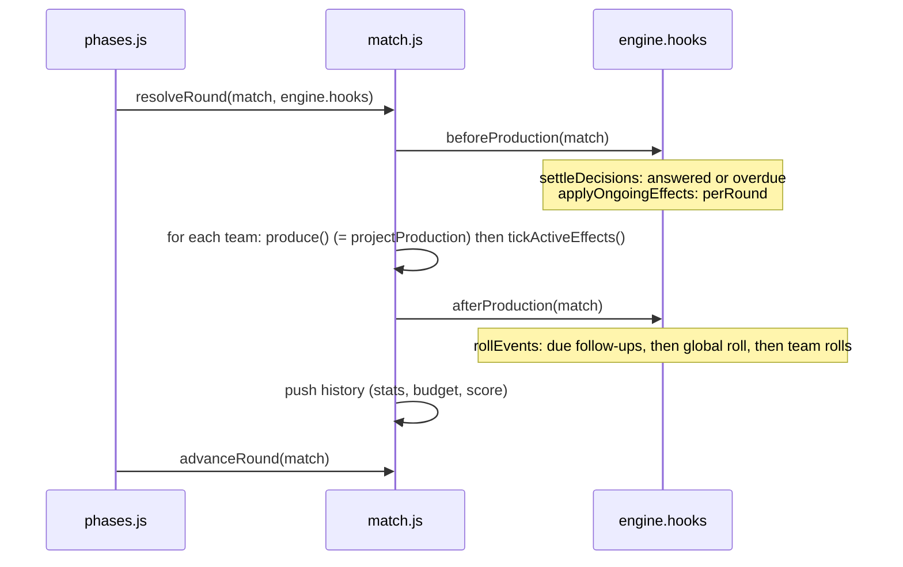

# Architecture

- [Overview](#overview)
- [Principles](#principles)
- [Server](#server)
- [Clients](#clients)
- [Match state and data model](#match-state-and-data-model)
- [Round resolution pipeline](#round-resolution-pipeline)
- [Event engine](#event-engine)
- [Determinism and snapshots](#determinism-and-snapshots)
- [Errors](#errors)
- [Not built yet](#not-built-yet)

---

## Overview



It's a single Node.js process with a single in-memory match and no database. All clients load the same React app from the same server and talk to it over Socket.IO. The message reference is in [PROTOCOL.md](PROTOCOL.md).

---

## Principles

| Principle | How it's enforced |
|---|---|
| **The server decides everything** | Clients only send requests (allocation, focus, answers, GM actions). The server checks and applies them; clients never calculate game state. |
| **Roles are checked on the server** | Every socket request declares which role may send it (`guest`, `team`, `gm`, `spectator`), and `sockets.js` rejects everything else with `forbidden`. GM and spectator access need passwords. |
| **Privacy in one place** | Every payload is built by `views.js`. Teams get their own state plus other teams' public identity and the feed; nothing else. |
| **Events are data** | No per-event code. `engine.js` interprets `events.json` generically. |
| **State is plain JSON** | Timers, sockets and session tokens are kept out of the match object, so it can be saved to a file and restored at any moment. |
| **Reproducible** | One seeded RNG, stored in the match, handles all randomness. |
| **Reconnect = full snapshot** | A reconnecting client sends its token in the handshake and gets a complete `state` payload; nothing is sent as a diff. |

---

## Server

```
server/src/
  index.js              entry: load config, create the game server, listen, print LAN URLs
  config.js             environment + /.env (passwords, SERVER_PORT, SEED)
  app.js                createGameServer(): Express + Socket.IO + match + engine + phase loop, no listening
  phases.js             createPhaseLoop(): the only place with game timers
  game/
    rules.js            tuning constants + computeScore() + the competition's disciplines
    match.js            state transitions (pure functions, no I/O)
    race.js             computeRace(): the end-of-season competition and its reveal timeline
    model.js            JSDoc typedefs for the data model
    rng.js              seeded PRNG
  events/
    engine.js           createEventEngine(): loading, rolls, decisions, follow-ups, GM trigger, views
    conditions.js       readPath(), checkConditions(), failingConditions(), computeRanks()
    effects.js          applyEffects(), addOngoing(), previewOutcome()
    posts.js            public feed posts: placeholder rendering, publishPost()
    validate.js         schema + cross-reference validation of events.json
  net/
    auth.js             session tokens, timing-safe password check with lockout
    views.js            guestView / teamView / spectatorView / gmView: all privacy rules
    sockets.js          request handlers, role checks, coalesced broadcast
```

### `config.js` and `index.js`

- Configuration comes from environment variables, with the repo-root `.env` as a fallback. Values already in the environment win.
- **`GM_PASSWORD` and `SPECTATOR_PASSWORD` are required**; the server exits with a clear message without them. Optional: `SERVER_PORT` (default 3000) and `SEED` (default `"workshop"`).
- `.env` is read by `config.js`, **not** with `node --env-file`: in watch mode Node would watch the whole folder containing `.env` (the repo root) and restart on *any* file change, including saving `events.json`, wiping the match.
- The variable is `SERVER_PORT` rather than `PORT`, because dev tools often set `PORT` for the Vite server, which would make the two collide.
- `index.js` exits with readable errors if `events.json` is invalid, then listens on `0.0.0.0` and prints the LAN URLs.

### `app.js`

`createGameServer({ gmPassword, spectatorPassword, seed, matchConfig, engineOptions, watchEvents, gate, clock, log })` builds everything without listening, so `index.js` and the integration tests share one setup. Tests use `matchConfig` for sub-second phases and `clock` for fake time. It returns `{ app, httpServer, io, match, engine, loop, broadcast, eventsStatus(), listen(port, host), close() }`. `close()` also stops the phase timer.

- Serves `client/dist` (with a fallback to `index.html` for client routes) when it exists, plus `GET /api/health`.
- With `watchEvents`, it watches `data/`, reloads events on change and broadcasts. If the new file is invalid, it logs the errors and keeps the previous definitions.
- No CORS: in dev, Vite forwards requests, and in production the client is same-origin.

In dev, `node --watch-path=src` restarts the server when server code changes. Event edits are hot-reloaded instead, so the match survives.

### `phases.js`

`createPhaseLoop({ match, engine, onChange, clock, log })` drives a running match. It's the only module with game timers, which keeps `match.js` pure.



| Method | Does |
|---|---|
| `start()` | `startMatch` + round 1's decision timer |
| `advance()` | ends the current phase now (resumes first if paused) |
| `pause()` / `resume()` | `pauseMatch` / `resumeMatch` + stop / re-arm the timer |
| `addTime(seconds)` | `adjustPhaseTime` + re-arm |
| `end()` / `reset(options)` | stop the timer + `endMatch` / `resetMatch` |
| `sync()` | re-arm from `match.phaseEndsAt`, e.g. after restoring a snapshot (step 9) |
| `stop()` | stop the timer, leave the match alone (shutdown) |
| `status()` | `{ timerArmed, lastError }`, sent to the GM |

How it stays correct:

- **The timer is derived from match state.** It always fires at `match.phaseEndsAt`. The match only stores timing fields, so a JSON snapshot can be resumed with `sync()`.
- **One timer at a time**, with a generation counter. Every GM action cancels and invalidates the previous timer, so an old decision timer can never resolve a round twice.
- **Early timers re-arm.** If a timer fires more than 25 ms before `phaseEndsAt`, it's rescheduled instead of transitioning.
- **Timer callbacks never throw.** An unexpected error in a transition (e.g. inside an event hook) is logged, the match is paused on the results screen with `resolutionSeconds` left, and `status().lastError` shows it to the GM until reset. Invalid GM requests (`GameError`) are still returned to the caller as normal errors.
- **Injectable clock** (`now`, `setTimeout`, `clearTimeout`), so tests can run whole matches in fake time.

### `race.js`

`computeRace(match)` runs the whole end-of-season competition in one pass once the season is over, using the match's seeded RNG, and returns both the results and a `steps` timeline for the GM to reveal. Nothing about it is live: recomputing the same finished match gives the same race.

- **Capability first.** Every discipline turns a team's final state into a 0–100 number from the weights in `RACE.disciplines` (stats, department output via `staffOutput()`, the share of the starting budget kept, season income). That's the only tuning surface.
- **Times are relative to the field.** Each discipline draws a day's pace around its typical time (±`RACE.dayVariation`), the best capability runs at that pace, everyone else is behind in proportion to the gap, and each run loses up to `RACE.runVariation`. Winning times are near 3.2 s / 4.6 s / 72 s, never exactly the same twice.
- **Points:** judged disciplines scale to the best score; timed ones use the Formula Student curve with a 1.5× cutoff. Driverless disciplines are `not-entered` (0) without the programme.
- **Endurance** is simulated lap by lap with per-lap failure chances from reliability, and a retirement reason weighted towards the team's thinnest department. Each lap step carries a timing board (total, gap, last and best lap per car) and the fastest lap so far.
- The timeline has one step per announcement: intro, each static's preliminary and finals, each dynamic discipline, 18 endurance laps, the endurance result, efficiency, the totals and the podium.

See [GAME_RULES.md → The competition](GAME_RULES.md#the-competition) for the rules as played, and `npm run sim:race` for tuning.

### `net/`

| Module | Responsibility |
|---|---|
| `auth.js` | `createSessions()`: random tokens → `{ role, teamId }`, revoke by token or team. `createPasswordGate()`: constant-time compare; 5 failures per client and role → 60 s lockout. Tokens live only in memory and never enter the match. |
| `views.js` | Builds every payload the server sends. The GM also gets `rules` and `scores` (computed here, never in the client). During the competition, teams and the spectator receive only the announced steps (`race.steps.slice(0, step + 1)`) and no totals until the podium; the GM gets the whole timeline. `teamView` gives the team's own state (flags and the `source` field stripped from its log), other teams as `{ id, name, color, location }`, and the last 50 feed posts. `spectatorView` gives the public parts. `gmView` gives the full match, online counts and event definitions. Teams never get a season score (`VISIBILITY.ownScoreDuringMatch` is off); teams and the spectator get `standings` only once the competition's podium is shown, while the GM gets season standings as soon as the season ends. |
| `sockets.js` | Handshake middleware (token → role), rooms (`guest`, `team:<id>`, `gm`, `spectator`), `on(socket, event, role, handler)` wrapper (role check, `GameError` → ack error, broadcast on success), and team session cleanup on leave/remove/reset. |

**Broadcasting:** after any successful request, and on connect, disconnect and event reload, `broadcast()` runs once per event-loop tick (coalesced with `setImmediate`). It builds one view per non-empty room: the GM, spectators, guests, and each team room.

### `match.js`

The functions here take a match, change it in place, and throw `GameError` when a request isn't allowed. They don't start timers or touch sockets.

| Function | Purpose |
|---|---|
| `createMatch(config)` | new match in the lobby |
| `addTeam(match, { name })` | random team setup; lobby only, unique name (`name_taken`) |
| `removeTeam(match, teamId)` | lobby only |
| `setAllocation(match, teamId, personnel)` | validated staff reallocation |
| `setFocus(match, teamId, performance)` | focus slider |
| `startMatch` / `pauseMatch(now)` / `resumeMatch(now)` / `endMatch` / `resetMatch` | lifecycle |
| `configureMatch(match, patch)` | lobby-only settings (`totalRounds`, `decisionSeconds`, `resolutionSeconds`) within `MATCH_LIMITS` |
| `patchTeam(match, teamId, { budget })` | the GM's live fix; writes a `gm` entry to the team's log |
| `addAnnouncement(match, text)` | a "Race Control" post in the public feed |
| `startPhaseTimer(match, now)` | sets `phaseEndsAt` for the current phase from the settings |
| `adjustPhaseTime(match, seconds, now)` | moves `phaseEndsAt` (running) or `pausedRemainingMs` (paused), minimum 1 s |
| `resolveRound(match, hooks)` | production + event hooks + history |
| `advanceRound(match)` | next decision phase, or end the match |
| `projectProduction(team, match)` | this round's production before events: stat gains, income, upkeep, a per-department breakdown with the value of one more person, and the programme's running cost. `resolveRound` applies exactly this, and the team view sends it as the forecast |
| `staffOutput(members)` | `members ^ SEASON.staffExponent`: diminishing returns on staff, used by production and the competition |
| `seasonScale(match)` | `SEASON.referenceRounds / totalRounds`: makes a season of any length end in the same place |
| `getTeam`, `headcount`, `teamModifier`, `clampStat`, `assertDecisionsOpen` | helpers |

---

## Clients

A single Vite + React app ([`client/`](../client)) chooses its view from the URL path, without a router library:

| Path | View | Status |
|---|---|---|
| `/` | `TeamView` → `team/TeamDashboard`, the team client | join screen, stat tiles, staff steppers, focus slider, decision cards, round forecast/results, active effects, private inbox, feed |
| `/gm` | `GmView` → `gm/GmDashboard`, Game Master dashboard | password login, control bar with countdown, live team table with inline budget edit, event trigger with eligibility check, Race Control posts, event-file status |
| `/screen` | `SpectatorView`, projector | password login, teams, feed, final standings; polish in step 10 |

- **Dev:** Vite runs on `:5173` (`strictPort`) with `host: true`, so phones on the LAN can connect. It forwards `/socket.io` (WebSocket) and `/api` to the game server on `SERVER_PORT` (read from the repo-root `.env`, default 3000).
- **Production:** `npm run build` outputs `client/dist`, which Express serves on the same port as the sockets.
- **Styling:** plain CSS with CSS variables ([`styles.css`](../client/src/styles.css)), dark theme, 48 px touch targets.
- **Connection:** [`net/game.js`](../client/src/net/game.js) has `useGame(view)`: one socket per view, the token kept in `localStorage` (under `eforce.token.<view>`, or `eforce.token.<view>.<slot>` with `?slot=` in the URL, so one browser can play several teams while testing) and sent in the handshake, the latest `state`, and a promise-based `request(event, payload)`. See [PROTOCOL.md → Client usage](PROTOCOL.md#client-usage).
- **Shared components:** [`components/common.jsx`](../client/src/components/common.jsx) has the connection dot, the phase line with a live countdown (`useCountdown(match, serverTime)`, ticking locally every 250 ms and red in the last 10 s of a decision phase), one-field form, feed, standings, and a raw state dump for debugging.
- **Competition:** [`race/RaceScreen.jsx`](../client/src/race/RaceScreen.jsx) renders the current announcement (tables, the endurance timing board with total time, gap, last and best lap, the podium) and is shared by the team screen, the projector and the GM — the GM version adds Back/Next controls.
- **Team screen:** [`team/`](../client/src/team) — `TeamDashboard` (layout + when inputs are locked), `KpiRow` (stat tiles with meters and last-round change), `StaffPanel` (±1/±5 steppers with each department's output and the value of one more person), `ProgrammePanel`, `FocusPanel`, `DecisionsPanel`, `RoundPanel` (forecast, or results during the results phase), `EffectsPanel`, `InboxPanel`.
- **GM screen:** [`gm/`](../client/src/gm) — `GmDashboard` (layout + one `run()` that surfaces errors), `ControlBar` (phase, timer, lifecycle buttons, lobby settings), `TeamTable` (live overview, sortable, inline budget editor), `TriggerPanel` (search, team picker, fire, "why wouldn't it fire?"), `PostPanel` (Race Control announcement + feed), `EventsStatus` (count, warnings, reload).
- **Helpers:** [`lib/format.js`](../client/src/lib/format.js) turns effect previews, logged changes and modifiers into text (department names come from `state.rules`, so no game content is hardcoded in the client); [`lib/useAction.js`](../client/src/lib/useAction.js) wraps a request with busy/error state for one control.

### How the team screen stays in sync

- **Local drafts, server truth.** The staff steppers and focus slider keep a local draft while the player fiddles, then send it. Every payload from the server replaces the draft (`JSON.stringify(me.personnel)` as the key), so an event that takes a person away is never overwritten by a stale draft.
- **Staff saves only when balanced.** Taking someone out of a department puts them "on the bench"; the allocation is sent automatically once the bench is empty, because the server requires the team size to stay the same. The status line always says whether the current state is saved.
- **Focus is debounced** ~300 ms after the last movement, and server values are ignored while a change is pending, so the slider doesn't jump under the player's finger.
- **The forecast comes from the server** (`me.projection`), so the client never reimplements the production rules: diminishing returns, headroom, location levels and season length only exist on the server.

---

## Match state and data model

The full typedefs are in [`model.js`](../server/src/game/model.js). Everything is JSON-serializable.



| Field | Values |
|---|---|
| `Match.status` | `lobby`, `running`, `paused`, `ended` |
| `Match.phase` | `lobby`, `decision`, `resolution`, `ended` |
| `Team.location` | `{ id, name, country }` |
| `Team.personnel` | `{ aero, chassis, powertrain, electronics, business }` staff per department |
| `Team.focus`, `Team.stats` | `{ performance, reliability }` |
| `Team.flags` | `{ [name]: boolean \| number \| string }` |
| `LogEntry.kind` | `event` (fired), `decision` (settled), `ongoing` (per-round tick) |
| `LogEntry.source` | `random`, `followUp`, `gm` (kind `event` only) |

Notes:

- **`eventHistory`** records every event that fired (`round`, `eventId`, `teamIds`, `source`: `random` / `followUp` / `gm`). `maxPerTeam`, `maxPerMatch` and cooldowns are all counted from it, so no separate counters can drift out of sync.
- **`Change`** entries in a log (`{ path, from, to, label? }`) record the **resolved** path. For example, `personnel.@largest` is logged as `personnel.aero`.
- **`feed`** holds public posts published by outcomes with a `post` template (`events/posts.js`). It's the only event-derived data that other teams and the spectator screen receive.
- **`race`** is `null` until the GM starts the competition, then holds the computed results and the reveal timeline (see [`race.js`](#racejs)). `Team.autonomous` marks a driverless programme.
- **What each role receives** is decided in `net/views.js` and documented in [PROTOCOL.md → Roles](PROTOCOL.md#roles-and-what-they-see). Team payloads never contain `flags`, `scheduledEvents`, raw `pendingDecisions` (they get `engine.decisionsView()`, which applies `hideEffects`), or other teams' numbers.

---

## Round resolution pipeline



`resolveRound` doesn't know events exist; it only calls the two optional hooks. `sim-state.js` runs it without hooks to test the economy on its own.

---

## Event engine

`createEventEngine({ file?, events?, rolls? })` returns:

| Member | Used by | Purpose |
|---|---|---|
| `hooks` | phase loop | pass to `resolveRound` |
| `reload()` | GM / watcher | re-read the file; keeps the old definitions if the new file is invalid |
| `watch(onReload)` | `index.js` | watch `data/` (150 ms debounce); returns a stop function |
| `get(id)`, `list()` | GM UI | frozen definitions with defaults filled in |
| `eligibleFor(match, teamId)` | GM UI | team events that could be rolled right now, with their odds |
| `explain(match, eventId, teamId)` | GM UI, CLI | `{ eligible, reasons[] }` |
| `trigger(match, eventId, { teamIds, respectConditions })` | GM | manual fire; ignores weight, limits and the decision limit |
| `answerDecision(match, teamId, instanceId, optionId)` | team socket | validated; can be changed until resolution |
| `decisionsView(match, teamId)` | team socket | pending decisions with option previews, `available`, `unavailableReason`, respects `hideEffects` |
| `steps` | tests | `settleDecisions`, `applyOngoingEffects`, `rollEvents` |

Inside the engine:

- **Definitions** are validated, filled in with defaults (`scope: "team"`, `enabled: true`), deep-cloned and **frozen**. Ongoing effects copy their `perRound` and `modifiers` onto the team, so a running effect never shares objects with the definitions.
- **Scope:** each step creates `{ match, rng, ranks }`. Ranks (`rank.*`) are calculated lazily, once per step.
- **Paths:** `conditions.js#readPath` is the only place that turns a path string into a value. `effects.js#write` is the only place that writes one. Adding a path means changing these two places plus the schema; see [DEVELOPMENT.md](DEVELOPMENT.md#adding-a-readable-or-writable-path).

### `decisionsView` shape

```js
{
  instanceId: 'd8', eventId: 'sensor_batch_failure', title, text, prompt,
  dueRound: 3, choice: null,
  options: [{
    id: 'rush_order', label: 'Rush replacement', description: 'New sensors in days.',
    available: false, unavailableReason: 'Requires budget ≥ 2500',
    effectsHidden: false,
    preview: {                                   // null when effectsHidden
      effects: [ { path: 'budget', op: 'add', value: -2500 },
                 { path: 'stats.reliability', op: 'add', value: 3 } ],
      ongoing: null                              // or { label, rounds, modifiers, perRound: PreviewEffect[] }
    }
  }],
  onTimeout: { option: 'run_without', preview: null }   // or { option: null, preview }
}
```

A preview effect is `{ path, op: 'add'|'multiply'|'set', value? , range?, per?, estimate? }`. Flags and follow-ups are never included.

---

## Determinism and snapshots

- `rng.js` implements mulberry32. Its whole state is a single uint32 stored in `match.rngState`. Every random number, from team setup through event rolls, ranges, `@random` and tie-breaks, is drawn from `createRng(match)`, which reads and writes that field.
- Same seed + same inputs in the same order = an identical match. `npm run sim:state`, `npm run sim:events` and the test suite all check this.
- `JSON.parse(JSON.stringify(match))` taken at any point continues exactly like the original. `sim:state` checks this with a snapshot taken halfway through a match.
- GM actions draw from the same RNG. A GM trigger therefore shifts every later roll, but replaying the same actions in the same order reproduces the match.
- Saving snapshots to disk every round (to recover from a crash) is planned for step 9.

---

## Errors

State functions throw `GameError` with a machine-readable `code`. `sockets.js` turns it into the request's ack, `{ ok: false, error: { code, message } }`. Any other exception is logged and returned as `internal`.

| Code | When |
|---|---|
| `forbidden` | request not allowed for this socket's role |
| `already_authenticated` | join or login from a signed-in socket |
| `invalid_password` / `too_many_attempts` | GM or spectator login |
| `invalid_name` / `name_taken` | team join |
| `match_ended` | acting on an ended match |
| `not_lobby` | joining, leaving, removing or starting outside the lobby |
| `match_full` | `maxTeams` reached |
| `no_teams` | starting with zero teams |
| `not_running` / `not_paused` | invalid pause/resume/resolve |
| `unknown_team` | bad team id |
| `decisions_closed` | allocation/focus/answer outside the lobby or decision phase |
| `invalid_allocation` | wrong departments, negative numbers, or a changed team size |
| `invalid_focus` | not a number |
| `unknown_event` | bad event id (GM trigger / explain) |
| `teams_required` | GM triggered a team event without choosing teams |
| `no_matching_teams` | `respectConditions` filtered out every team |
| `unknown_decision` | decision already settled, or a bad id |
| `unknown_option` | bad option id |
| `option_unavailable` | option's `requires` not met (the message says why) |
| `internal` | unexpected server error |

Invalid event files throw `EventDefinitionError`, with the individual messages in `errors[]`.

---

## Not built yet

See [ROADMAP.md](ROADMAP.md) for the full list. Architecturally still missing:

- GM direct state edits and feed posts (step 7)
- Crash recovery via JSON snapshots on disk, including session tokens (step 9)
