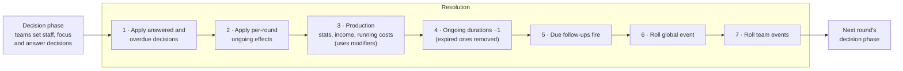

# Event authoring guide

Random events are plain data in [`data/events.json`](../data/events.json). You can add, change or disable events without touching engine or UI code. The engine loads the file, decides which events a team is eligible for, picks one at random by weight, and applies the effects generically.

- [Workflow](#workflow)
- [Anatomy of an event](#anatomy-of-an-event)
- [Event fields](#event-fields)
- [Conditions](#conditions)
- [Effects](#effects)
- [Ongoing effects](#ongoing-effects)
- [Decisions](#decisions)
- [Follow-ups](#follow-ups)
- [Public posts](#public-posts)
- [Global events](#global-events)
- [Timing: when things happen](#timing-when-things-happen)
- [How random events are picked](#how-random-events-are-picked)
- [Recipes](#recipes)
- [Validation messages](#validation-messages)
- [Tips and gotchas](#tips-and-gotchas)

---

## Workflow

1. **Edit** `data/events.json`. The first line (`"$schema": "./events.schema.json"`) gives VS Code and other JSON Schema-aware editors autocomplete, hover docs and red squiggles.
2. **Validate:**
   ```bash
   npm run events:check
   ```
3. **Try it.** This fires the event on a sample team, shows the decision exactly as the team would see it, then plays out every option, the timeout, and any ongoing effects or follow-ups:
   ```bash
   npm run sim:events -- --try=your_event_id
   ```
4. **Check frequency** across many simulated matches, to tune `weight`:
   ```bash
   npm run sim:events -- --matches=300
   ```

**Sizing effects.** Teams have 30–140 people and start with €80,000–€400,000; a typical team spends roughly €10,000–€50,000 more than it earns over a round's running costs and sponsorship, and gains a few stat points per round (see [GAME_RULES.md → Round production](GAME_RULES.md#round-production)). A "small" money event is therefore €10,000–€20,000 and a big one €50,000 or more; staff events move 1–4 people. Event effects are not scaled by season length, so the same event matters a bit more in a short season.

If the server is running, it reloads the file on save. When the new file is invalid, the server logs the errors and keeps the previous events, so a typo mid-workshop won't take the game down.

JSON has no comments. Put designer notes in the `notes` field instead; it is never shown in game.

---

## Anatomy of an event

```json
{
  "id": "sensor_batch_failure",
  "title": "Sensor Batch Failure",
  "text": "Half of the new wheel-speed sensors failed bench testing, two weeks before competition.",
  "tags": ["decision", "electronics"],
  "notes": "Immediate hit, then a choice.",

  "weight": 6,
  "conditions": { "round": { "min": 2 }, "personnel.electronics": { "min": 1 } },
  "maxPerTeam": 1,

  "effects": { "stats.reliability": -3 },

  "decision": {
    "prompt": "Pay for a rush replacement, or race without the redundant sensor set?",
    "options": [
      {
        "id": "rush_order",
        "label": "Rush replacement",
        "description": "New sensors in days.",
        "requires": { "budget": { "min": 20000 } },
        "result": "The replacement batch passed bench testing.",
        "effects": { "budget": -20000, "stats.reliability": 3 }
      },
      {
        "id": "run_without",
        "label": "Run without",
        "result": "The car now runs on a single sensor set.",
        "ongoing": { "label": "No backup sensors", "rounds": 3, "perRound": { "stats.reliability": -1 } },
        "followUp": { "event": "sensor_dropout", "inRounds": 2 }
      }
    ],
    "onTimeout": { "option": "run_without" }
  }
}
```

Every event has three parts:

| Part | Fields |
|---|---|
| **Who and when** | `scope`, `weight`, `conditions`, `maxPerTeam`, `maxPerMatch`, `cooldownRounds`, `enabled` |
| **What happens immediately** | `effects`, `ongoing`, `followUp`, `post` |
| **What the team decides** | `decision` (optional) |

An **outcome** is a set of `effects`, `ongoing`, `followUp` and `post` that gets applied together. The event itself is an outcome, and so is every decision option and a custom `onTimeout`, so all three use the same syntax.

> **Events are private.** Only the affected team sees an event's title, text and effects. Other teams and the spectator screen only see what you publish with [`post`](#public-posts).

---

## Event fields

| Field | Type | Required | Default | Meaning |
|---|---|---|---|---|
| `id` | snake_case string | ✅ | | Unique. Used in logs, the GM trigger list, `followUp` and `active.<id>` conditions. |
| `title` | string ≤ 60 | ✅ | | Headline shown to the team. |
| `text` | string | ✅ | | Flavor text shown when the event fires. |
| `weight` | number ≥ 0 | ✅ | | Relative odds among eligible events of the same scope. `20` is twice as likely as `10`. `0` = never random (only via follow-up or GM). |
| `scope` | `"team"` \| `"global"` | | `"team"` | See [Global events](#global-events). |
| `enabled` | boolean | | `true` | `false` removes it from the random pool. GM triggers and follow-ups still fire it. |
| `conditions` | [conditions](#conditions) | | always | When the event is eligible for a team. |
| `maxPerTeam` | integer ≥ 1 | | unlimited | Max times one team can get it per match. |
| `maxPerMatch` | integer ≥ 1 | | unlimited | Max firings per match overall. A global event counts once per firing, however many teams it hits. |
| `cooldownRounds` | integer ≥ 1 | | none | The team must go this many rounds without it before it can fire for them again. `2` = fired in round 1, blocked in rounds 2 and 3, eligible in round 4. |
| `effects` | [effects](#effects) | one of these three | | Applied when the event fires. |
| `ongoing` | [ongoing](#ongoing-effects) | one of these three | | Lasting effect that starts when the event fires. |
| `decision` | [decision](#decisions) | one of these three | | A choice the team answers next decision phase. |
| `followUp` | [followUp](#follow-ups) | | | Guaranteed later event. |
| `post` | string ≤ 280 | | | [Public snippet](#public-posts) for the shared feed when the event fires. |
| `tags` | string[] | | | Free-form labels (GM filtering). |
| `notes` | string | | | Designer notes, never shown. |

An event must have at least one of `effects`, `ongoing` or `decision`.

`maxPerTeam`, `maxPerMatch` and `cooldownRounds` count **every** firing, including GM triggers and follow-ups. They only *block* random rolls, though: GM triggers and follow-ups ignore them.

---

## Conditions

A conditions object is a list of checks that **all** have to pass. Each key is a state path. Each value is either the exact value to match or an operator object.

```json
"conditions": {
  "round": { "min": 2, "max": 6 },
  "personnel.aero": { "min": 10 },
  "flags.noBackupSensors": true,
  "location.country": { "in": ["CZ", "AT"] }
}
```

### Readable paths

| Path | Value | Notes |
|---|---|---|
| `round` | integer | Current round, starting at 1 (0 in the lobby). |
| `budget` | integer € | Can be negative (debt). |
| `stats.performance`, `stats.reliability`, `stats.autonomy` | 0–100 | One decimal place. `autonomy` only grows with a driverless programme. |
| `autonomous` | boolean | Whether the team runs the driverless programme. |
| `personnel.aero` / `.chassis` / `.powertrain` / `.electronics` / `.business` / `.driverless` | integer | Staff in that department. `driverless` is 0 unless the team runs the driverless programme. |
| `personnel.total` | integer | Team size. |
| `focus.performance`, `focus.reliability` | 0–100 | Focus slider; the two always add up to 100. |
| `location.id`, `location.country` | string | e.g. `"prague"`, `"CZ"`. The list is in [GAME_RULES.md](GAME_RULES.md#locations). |
| `rank.performance`, `rank.reliability`, `rank.autonomy`, `rank.budget`, `rank.score` | integer | The team's place among all teams, **1 = best**. Tied teams share the better place. |
| `flags.<name>` | boolean / number / string | Custom flag set by an earlier event. **Unset flags read as `false`**. |
| `active.<id>` | boolean | `true` while an ongoing effect with that id is running on the team. |

### Operators

| Form | Passes when |
|---|---|
| `"path": 3` / `"path": true` / `"path": "CZ"` | value equals it |
| `{ "min": 2 }` | value ≥ 2 |
| `{ "max": 5 }` | value ≤ 5 |
| `{ "eq": 3 }` | value = 3 |
| `{ "ne": 3 }` | value ≠ 3 |
| `{ "in": ["CZ", "AT"] }` | value is one of the list |
| `{ "notIn": ["CZ"] }` | value is not in the list |

You can combine operators in one object: `{ "min": 2, "max": 5 }` means both must hold.

For flags, `true`/`false` and `1`/`0` count as equal. So an unset flag passes `{ "max": 0 }` and `false`, and fails `{ "min": 1 }`.

### Combining: `any` and `not`

```json
"conditions": {
  "round": { "min": 3 },
  "any": [
    { "focus.performance": { "min": 80 } },
    { "budget": { "max": 30000 } }
  ],
  "not": { "location.country": "CZ" }
}
```

- `any`: at least one of the listed blocks must pass (OR). Inside each block, every entry must pass (AND).
- `not`: the block must **not** pass.
- You can nest them freely.

---

## Effects

An effects object maps a writable path to a change.

```json
"effects": {
  "budget": -20000,
  "stats.performance": [2, 5],
  "personnel.@largest": [-4, -2],
  "flags.burnouts": 1
}
```

### Writable paths

| Path | Clamped to |
|---|---|
| `budget` | whole euros; may go negative |
| `stats.performance`, `stats.reliability`, `stats.autonomy` | 0–100, one decimal place |
| `personnel.<department>` | whole number ≥ 0 |
| `personnel.@random` | a random department (when removing, only departments that have people) |
| `personnel.@largest` | the department with the most people (ties broken randomly) |
| `personnel.@smallest` | the department with the fewest people (when removing, only non-empty ones; ties broken randomly) |
| `flags.<name>` | any value; see below |

`personnel.total`, `focus.*`, `round`, `location.*`, `rank.*` and `active.*` are **read-only**. Teams control focus themselves, and ongoing effects are started with [`ongoing`](#ongoing-effects).

### Change forms

| Form | Example | Result |
|---|---|---|
| number | `"budget": -20000` | adds (negative subtracts) |
| `[min, max]` | `"budget": [15000, 30000]` | adds a random whole number in that range (inclusive) |
| `{ "add": n }` | `{ "add": -2500 }` | same as a plain number |
| `{ "add": n, "per": path }` | `{ "add": -400, "per": "personnel.total" }` | adds `n × value of path`, e.g. −400 per team member |
| `{ "multiply": x }` | `{ "multiply": 0.93 }` | multiplies (0.93 = −7%) |
| `{ "set": v }` | `{ "set": 0 }` | replaces the value |

`add` and `set` also accept a `[min, max]` range. `per` works with `round`, `stats.*`, `personnel.<department>` and `personnel.total`.

Random ranges use the match's seeded RNG, so the same seed with the same inputs always gives the same numbers.

### Flags

Flags are your own named values on a team. They're used to chain events together, and teams never see them.

| Form | Result |
|---|---|
| `"flags.noBackupSensors": true` | sets it to `true` |
| `"flags.supplier": "acme"` | sets it to a string |
| `"flags.burnouts": 1` | **adds** 1 (counter; an unset flag counts as 0) |
| `"flags.burnouts": { "set": 0 }` | resets it |

---

## Ongoing effects

An ongoing effect lasts a number of rounds.

```json
"ongoing": {
  "id": "aero_lead_sick",
  "label": "Aero output halved",
  "rounds": 2,
  "perRound": { "budget": -3000 },
  "modifiers": { "output.aero": 0.5 }
}
```

| Field | Required | Meaning |
|---|---|---|
| `label` | ✅ | Shown on the team's dashboard while active (≤ 60 chars). |
| `rounds` | ✅ | How many round resolutions it lasts (1–20). |
| `perRound` | one or both | [Effects](#effects) applied at every resolution while active. |
| `modifiers` | one or both | Multipliers on that round's production, listed below. |
| `id` | | Defaults to the event's id. Use it for `active.<id>` conditions. |

**No stacking.** If an effect with the same `id` is already running, it is replaced and its duration restarts. To let two copies run side by side, give them different ids.

### Modifiers

Modifiers multiply what a team produces each round. `0.5` halves it, `1.2` adds 20%, and `0` switches it off. If several active effects set the same modifier, they multiply together.

| Modifier | Scales |
|---|---|
| `output.aero` / `.chassis` / `.powertrain` / `.electronics` / `.driverless` | that department's contribution to stat gains |
| `output.business` | sponsorship income from business staff |
| `gain.performance`, `gain.reliability`, `gain.autonomy` | total stat gain that round |
| `income` | all income (university funding + sponsorship) |
| `upkeep` | per-member running costs (travel, safety gear, tools) |

The exact formulas are in [GAME_RULES.md](GAME_RULES.md#round-production).

---

## Decisions

A decision gives the team a choice between 2–4 options. They answer during the next decision phase.

```json
"decision": {
  "prompt": "Take the money?",
  "hideEffects": true,
  "options": [
    {
      "id": "accept",
      "label": "Shake hands",
      "description": "Money is money.",
      "result": "€50,000 lands in the team account.",
      "effects": { "budget": 50000 },
      "followUp": { "event": "investor_scandal", "inRounds": 2 }
    },
    { "id": "decline", "label": "Politely decline", "result": "The founder walks away." }
  ],
  "onTimeout": { "result": "While you were deliberating, the founder lost interest." }
}
```

### Decision fields

| Field | Required | Meaning |
|---|---|---|
| `prompt` | ✅ | The question. |
| `options` | ✅ | 2–4 options. |
| `onTimeout` | ✅ | What happens if the team doesn't answer in time. |
| `hideEffects` | | `true` / `false`, default `false`. See [Hiding effects](#hiding-effects). |

### Option fields

| Field | Required | Meaning |
|---|---|---|
| `id` | ✅ | Unique within the decision. |
| `label` | ✅ | Button text (≤ 40 chars). |
| `description` | | Shown under the button. |
| `requires` | | [Conditions](#conditions). If they don't pass, the option is locked and shows "Requires budget ≥ 20000". The server checks again when the team answers and again when the answer is applied. |
| `result` | | Log line after the choice is applied. |
| `effects`, `ongoing`, `followUp`, `post` | | The option's outcome. All are optional; an option with none of them does nothing. |
| `hideEffects` | | `true` / `false`: overrides the decision's `hideEffects` for this option only. |

### Timeout

There are two ways to write `onTimeout`:

```json
"onTimeout": { "option": "run_without" }
```

This reuses an option's outcome. The option's `requires` is **ignored** here, because this is the designer's chosen default.

```json
"onTimeout": {
  "result": "While you were deliberating, the founder lost interest.",
  "effects": { "stats.performance": -1 },
  "ongoing": { "...": "..." },
  "followUp": { "event": "..." },
  "post": "{team} missed the deadline"
}
```

This is a separate outcome. `result` is required; `effects`, `ongoing`, `followUp` and `post` are optional.

### Hiding effects

By default, each option shows a preview of what it will do, for example "budget −€20,000, reliability +3" or "⟳ No backup sensors for 3 rounds".

| `decision.hideEffects` | `option.hideEffects` | Preview shown for that option? |
|---|---|---|
| not set / `false` | not set | ✅ yes |
| `true` | not set | ❌ no |
| `true` | `false` | ✅ yes (the option un-hides itself) |
| not set / `false` | `true` | ❌ no (the option hides itself) |

A custom `onTimeout` outcome is previewed only when `decision.hideEffects` is not `true`.

This setting only hides the preview. After the choice is applied, the team's log still shows what actually changed. Flags, follow-ups and posts are **never** previewed, whatever this setting says.

### Answering rules

- A team can change its answer as often as it likes until the decision phase ends.
- The chosen option's `requires` is checked again when the answer is applied. If it no longer passes (for example, the GM edited the budget), the answer counts as **no answer** and the timeout applies.
- By default a team can only hold **1** unanswered decision at a time (`maxPendingDecisions` in `rules.js`). Random decision events skip teams that already have one. GM triggers and follow-ups ignore this limit.
- Random decision events don't fire in the **final round**, because there would be no round left to answer them.

---

## Follow-ups

A follow-up makes another event fire for the same team a set number of rounds later, **guaranteed**.

```json
"followUp": { "event": "sensor_dropout", "inRounds": 2 }
```

| Field | Required | Default | Meaning |
|---|---|---|---|
| `event` | ✅ | | id of the event to fire. It must exist. |
| `inRounds` | | `1` | Rounds after the round in which the follow-up was triggered (1–20). |

- You can put `followUp` on an event, on a decision option, or in a custom `onTimeout` outcome.
- The target fires **no matter what**: its `weight`, `conditions`, limits, `enabled` setting and the pending-decision limit are all ignored.
- Teams can't see scheduled follow-ups. The GM can (`team.scheduledEvents`).
- It fires at the **end** of round *(trigger round + inRounds)*, before random rolls. If that round is past the end of the match, it never fires.
- A team that gets a follow-up skips its own random team-event roll that round, so it isn't hit twice. Set `rollAfterFollowUp: true` in `rules.js` to change that. Global events can still hit that team.
- If the target is a global event, it only hits the team that scheduled it.
- If the target has a decision, that decision is created as usual.
- A follow-up-only event usually has `"weight": 0`. The checker only warns about weight-0 events that nothing follows up into.

**Follow-up vs flag chain:**

| | `followUp` | flag + conditions |
|---|---|---|
| Will it happen? | always | only if rolled (weight decides) |
| When? | exactly `inRounds` later | any later round |
| Can depend on other state? | no | yes (combine with other conditions) |
| Example | investor → scandal | two burnouts → recruitment slump |

---

## Public posts

Events are private. Other teams never see what happened to a team, just like in real life. What they *do* see is a shared **feed** of social-media snippets: sponsorship announcements, teaser photos, awkward LinkedIn posts. You decide what becomes public by adding a `post` to an outcome.

```json
{
  "id": "local_sponsor",
  "effects": { "budget": [15000, 35000] },
  "post": "🤝 {team} announces a €{change.budget} partnership with a regional engineering firm!"
}
```

The feed then shows `🤝 eForce Prague announces a €23,480 partnership with a regional engineering firm!` to every team and the spectator screen.

| Placeholder | Becomes |
|---|---|
| `{team}` | the team's name |
| `{location}` | the team's city |
| `{country}` | the team's country code |
| `{change.budget}` | how much this outcome changed the budget, as a positive number with thousands separators (`2,898`) |
| `{change.stats.performance}`, `{change.stats.reliability}` | size of that stat change (`4`, `2.5`) |
| `{change.stats}` | combined size of both stat changes |
| `{change.personnel}` | people added or removed, in any department (works with `@largest` etc.) |
| `{change.personnel.aero}` | people added or removed in one department |

Rules:

- `post` works anywhere an outcome goes: on the event, on a decision option, and in a custom `onTimeout`. A timeout that reuses an option (`{ "option": "…" }`) publishes that option's post.
- **One post per team the outcome is applied to.** For a global event that hits 6 teams, that means 6 posts, so global events usually shouldn't have one.
- `{change.x}` only counts changes made by **the same outcome**. On a decision option, it's that option's effects, not the event's immediate effects.
- It's always a positive size. Write the direction into the text: "loses €{change.budget}".
- Posts are never previewed on decision options, so a post can't give away a hidden outcome.
- Posts are plain text, up to 280 characters. Emoji are welcome.
- The feed keeps every post. Teams and the spectator screen get the latest 50; the GM gets all of them.

**What to post:** anything a real team would announce or that would leak publicly (sponsors, new parts, public failures at testing, scandals). **What not to post:** internal problems a team would keep quiet, like a sick engineer or a bad sensor batch. Leaving those private gives the teams something to discover and talk about.

---

## Global events

`"scope": "global"` events are rolled once per round for the whole match, not per team.

```json
{
  "id": "hv_safety_audit",
  "scope": "global",
  "title": "HV Safety Audit",
  "text": "Teams with shaky reliability must send every member to a certified HV course.",
  "weight": 5,
  "conditions": { "round": { "min": 3 }, "stats.reliability": { "max": 35 } },
  "maxPerMatch": 1,
  "effects": { "budget": { "add": -400, "per": "personnel.total" } }
}
```

- `conditions` decide **which teams get hit**. The event is only eligible if at least one team passes.
- Every team that passes gets the effects at the same moment, each calculated against its own state. In the example above, each team pays €400 × its own team size.
- If the event has a decision, each affected team answers it separately.
- Per-team limits (`maxPerTeam`, `cooldownRounds`, the pending-decision limit) also filter which teams get hit.
- Use `maxPerMatch` to limit how often it fires in total.

---

## Timing: when things happen

Each round runs through these steps:



What that means for an event that fires at the end of round **N**:

| Thing | Happens |
|---|---|
| Its `effects` | immediately (end of round N) |
| Its decision | answered during round N+1's decision phase, applied at the **start** of round N+1's resolution |
| Unanswered decision | timeout applied at the start of round N+1's resolution |
| Its `ongoing` with `rounds: 3` | modifiers and per-round effects apply during rounds N+1, N+2, N+3 |
| Its `followUp` with `inRounds: 2` | fires at the end of round N+2 |
| An option's `ongoing` with `rounds: 3` | the option is applied at the start of round N+1's resolution, then runs during rounds N+1, N+2, N+3 |
| An option's `followUp` with `inRounds: 2` | the option is applied in round N+1, so the follow-up fires at the end of round N+3 |

**Events the GM triggers during a decision phase** apply their effects immediately. If the team answers the decision in that same phase, the answer is applied at that round's resolution. Otherwise the team gets the next round's decision phase too, and the timeout applies at the following resolution.

---

## How random events are picked

In each resolution, after production:

1. **Follow-ups** that are due fire for their teams.
2. **Global roll:** with probability `globalEventChance`, pick one global event, weighted, from those still under `maxPerMatch` that at least one team is eligible for. It hits every eligible team.
3. **Team rolls:** for each team (skipping teams that just got a follow-up), with probability `teamEventChance`, pick one team event, weighted, from those the team is eligible for.

Random rolls start at `firstRound`. A team event is **eligible** for a team when all of these hold:

- `enabled` is not `false` and `weight` > 0
- `maxPerMatch` not reached
- `maxPerTeam` not reached for this team
- not on cooldown for this team
- if it has a decision: the team is under the pending-decision limit, and this isn't the final round
- `conditions` pass

The probabilities are set in [`rules.js`](../server/src/game/rules.js) (`EVENT_ROLLS`). See [GAME_RULES.md](GAME_RULES.md#random-event-frequency).

**Weight is relative.** An event with weight 10 is twice as likely as one with weight 5, *among the events eligible at that moment*. If only one event is eligible, it gets picked regardless of weight. So an event with narrow conditions and a high weight can fire very reliably once those conditions are met.

---

## Recipes

These are snippets to copy and adapt. Some show only the relevant part of an event, and `"...": "..."` stands for fields left out, so don't paste those placeholders as-is.

### Simple budget bonus
```json
{
  "id": "crowdfunding",
  "title": "Crowdfunding Goes Viral",
  "text": "A video of your car's first shakedown gets a million views.",
  "weight": 6,
  "cooldownRounds": 3,
  "effects": { "budget": [10000, 25000] }
}
```

### Stat hit that depends on staffing
```json
{
  "id": "harness_short",
  "title": "Wiring Harness Short",
  "text": "An understaffed electronics team missed a chafed cable.",
  "weight": 8,
  "conditions": { "personnel.electronics": { "max": 6 } },
  "effects": { "stats.reliability": -5 }
}
```

### Cost that scales with the team
```json
"effects": { "budget": { "add": -300, "per": "personnel.total" } }
```

### Temporary debuff
```json
{
  "id": "dyno_broken",
  "title": "Dyno Out of Service",
  "text": "The university dyno is down for repairs.",
  "weight": 5,
  "conditions": { "personnel.powertrain": { "min": 8 }, "active.dyno_broken": false },
  "ongoing": { "label": "No dyno: powertrain output −40%", "rounds": 2, "modifiers": { "output.powertrain": 0.6 } }
}
```

### Damage over time
```json
"ongoing": { "label": "Leaking coolant", "rounds": 3, "perRound": { "stats.reliability": -1.5 } }
```

### Choice with a locked expensive option
```json
"decision": {
  "prompt": "Carbon or aluminium wishbones?",
  "options": [
    { "id": "carbon", "label": "Carbon", "requires": { "budget": { "min": 30000 } },
      "effects": { "budget": -30000, "stats.performance": 5 } },
    { "id": "alu", "label": "Aluminium", "effects": { "stats.reliability": 2 } }
  ],
  "onTimeout": { "option": "alu" }
}
```

### Surprise choice with one visible option
```json
"decision": {
  "prompt": "A mysterious crate arrives. Open it?",
  "hideEffects": true,
  "options": [
    { "id": "open", "label": "Open it", "effects": { "stats.performance": [-3, 6] } },
    { "id": "return", "label": "Send it back", "hideEffects": false, "effects": { "budget": -2000 } }
  ],
  "onTimeout": { "option": "return" }
}
```

### Guaranteed consequence
```json
{ "id": "cut_corners", "...": "...",
  "decision": { "prompt": "Skip the FMEA review to save time?", "options": [
    { "id": "skip", "label": "Skip it", "effects": { "stats.performance": 3 },
      "followUp": { "event": "scrutineering_fail", "inRounds": 3 } },
    { "id": "do_it", "label": "Do the review", "effects": { "stats.performance": -1 } }
  ], "onTimeout": { "option": "do_it" } } },
{ "id": "scrutineering_fail", "title": "Failed Scrutineering", "text": "...", "weight": 0,
  "effects": { "stats.reliability": -8 } }
```

### Probabilistic chain with a counter flag
```json
{ "id": "crunch_burnout", "...": "...", "effects": { "personnel.@largest": [-4, -2], "flags.burnouts": 1 } },
{ "id": "recruitment_slump", "...": "...", "weight": 12, "maxPerTeam": 1,
  "conditions": { "flags.burnouts": { "min": 2 } },
  "effects": { "personnel.@random": [-3, -1] } }
```

### One-shot flag (fire once, then clear)
```json
{ "id": "pending_audit", "...": "...", "conditions": { "flags.auditRisk": true },
  "effects": { "budget": -25000, "flags.auditRisk": false } }
```

### Help for trailing teams
```json
{
  "id": "underdog_grant",
  "title": "Underdog Grant",
  "text": "A foundation supports teams fighting back from the bottom of the table.",
  "weight": 10,
  "conditions": { "rank.score": { "min": 7 }, "round": { "min": 3 } },
  "maxPerTeam": 1,
  "effects": { "budget": 30000 }
}
```

### Global event that only hits some teams
```json
{
  "id": "customs_delay",
  "scope": "global",
  "title": "Customs Delay",
  "text": "Parts shipped from outside the EU are stuck at the border.",
  "weight": 4,
  "maxPerMatch": 1,
  "conditions": { "location.country": { "in": ["CH", "GB"] } },
  "ongoing": { "label": "Parts stuck in customs", "rounds": 1, "modifiers": { "gain.performance": 0.5 } }
}
```

### Public snippet only when the team chooses something visible
```json
"options": [
  { "id": "launch", "label": "Launch the new livery", "effects": { "budget": -8000, "stats.performance": 1 },
    "post": "🎨 {team} unveils a bold new livery. Fans are divided." },
  { "id": "wait", "label": "Keep it under wraps", "result": "The livery stays in the workshop for now." }
]
```

### Public failure with a scaled number
```json
{
  "id": "garage_fire",
  "title": "Workshop Fire",
  "text": "A LiPo pack caught fire overnight. Nobody was hurt, but tools and spares are gone.",
  "weight": 2,
  "maxPerTeam": 1,
  "effects": { "budget": [-40000, -20000], "stats.reliability": -3 },
  "post": "🚒 Firefighters called to {team}'s workshop overnight. Estimated damage: €{change.budget}."
}
```

### Something that only hits driverless teams
```json
{
  "id": "sensor_calibration_drift",
  "title": "LiDAR Calibration Drift",
  "text": "Overnight temperature swings knocked your LiDAR calibration out. The car sees cones where there are none.",
  "weight": 7,
  "conditions": { "autonomous": true, "personnel.driverless": { "min": 1 } },
  "cooldownRounds": 3,
  "effects": { "stats.autonomy": -4 },
  "post": "🤖 {team}'s driverless car took an unscheduled detour through the cones at testing."
}
```

### GM-only event
```json
{ "id": "fire_alarm", "title": "Fire Alarm", "text": "The workshop is evacuated.", "weight": 1, "enabled": false,
  "scope": "global", "effects": { "stats.performance": -1 } }
```
With `enabled: false`, the event never fires randomly but still appears in the GM trigger list. `"weight": 0` does the same, except the checker warns about it unless something follows up into it.

---

## Validation messages

`npm run events:check` exits with code 1 if there are **errors** (✗). **Warnings** (⚠) are printed but don't fail the check. The server runs the same checks when it starts and whenever the file changes.

| Message | Fix |
|---|---|
| `unknown key "weigth" — did you mean "weight"?` | typo in a field or path |
| `must have required property 'text'` | add the field |
| `expected a number, [min, max], { "add": … }, { "multiply": … } or { "set": … }` | invalid effect value |
| `expected a number or an operator object like { "min": 2 }` | invalid condition value |
| `duplicate id` | event or option ids must be unique |
| `needs at least one of "effects", "ongoing" or "decision"` | the event does nothing |
| `ongoing: needs "perRound", "modifiers" or both` | the ongoing effect does nothing |
| `onTimeout: no option with id "…"` | `onTimeout.option` must match an option id |
| `followUp: no event with id "…"` | follow-up target doesn't exist |
| `range [5,1] has min greater than max` | swap the numbers |
| ⚠ `reads "flags.x" but no event ever sets it (typo?)` | a flag name is misspelled or never set |
| ⚠ `reads "active.x" but no ongoing effect has that id` | an `active.` id is misspelled |
| ⚠ `weight is 0 and nothing follows up into it` | only the GM can trigger it; intended? |
| `post: unknown placeholder {…}` | only `{team}`, `{location}`, `{country}` and `{change.<path>}` are supported |
| ⚠ `{change.x} but this outcome's effects don't change "x", so it will read 0` | the placeholder is on an outcome that doesn't change that value, e.g. on the decision instead of the option |
| ⚠ `events.schema.json: … is missing "…" (defined in rules.js)` | a department or stat was added to `rules.js` but not to the schema; see [DEVELOPMENT.md](DEVELOPMENT.md#adding-a-department) |

The checker only runs its cross-reference checks (the rows from `duplicate id` down) once the file matches the schema. Fix the schema errors first, then run it again.

---

## Tips and gotchas

- **Keep ids stable** once a match is running. Pending decisions and scheduled follow-ups refer to events by id. If you remove an event mid-match, its pending decisions are dropped (with a log line) and its scheduled follow-ups are skipped.
- **Ongoing effects keep their definition.** Editing an event while its ongoing effect is active on a team doesn't change that running copy; only new firings use the new definition.
- **Effects run top to bottom.** In `{ "personnel.@largest": -2, "budget": { "add": -200, "per": "personnel.total" } }`, the budget is charged for the team size *after* someone left.
- **Test with `--try`** before a workshop. It uses a fixed seed and random rolls are off, so every option plays out the same way each run.
- **Use `--matches=300` for balance.** The "hits / team" column tells you how often an average team sees each event per match.
- **`@random` and ranges are reproducible.** They use the match seed, so replaying a seed gives the same result.
- **Posts are the only public part of an event.** Everything else (title, text, effects, decisions) is seen only by the affected team, the GM and the CLI. `npm run sim:events` prints posts with 📣 so you can read the feed while designing.
