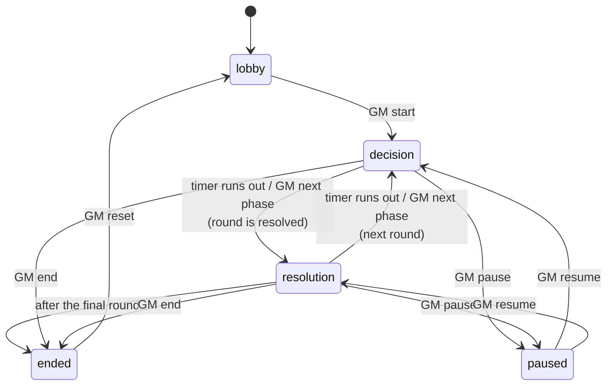

# Game rules and tuning

Every balance number and the scoring formula live in one file: [`server/src/game/rules.js`](../server/src/game/rules.js). Events are the exception; they're in [`data/events.json`](../data/events.json) (see [EVENTS.md](EVENTS.md)).

This page describes the rules as they are **currently implemented**, with the default values. If you change `rules.js`, update the tables here too.

- [Match structure](#match-structure)
- [Joining](#joining)
- [Starting conditions](#starting-conditions)
- [What teams can see](#what-teams-can-see)
- [Team decisions](#team-decisions)
- [The driverless programme](#the-driverless-programme)
- [Round production](#round-production)
- [The competition](#the-competition)
- [Random event frequency](#random-event-frequency)
- [Scoring](#scoring)
- [Balance notes](#balance-notes)

---

## Match structure

`MATCH_DEFAULTS`. The GM can change the first three in the lobby, within `MATCH_LIMITS`:

| Setting | Default | GM can set | Meaning |
|---|---|---|---|
| `totalRounds` | 14 | 1–30 | The match ends after this round's results. The season is balanced for any length (see [Season length](#season-length)). |
| `decisionSeconds` | 75 | 10–600 | Length of the decision phase. |
| `resolutionSeconds` | 12 | 3–120 | How long round results are shown before the next decision phase. |
| `maxTeams` | 12 | | Join limit. |
| `seed` | `"workshop"` | | RNG seed (server env var `SEED`). Same seed + same inputs = same match. |

A round runs on the server's timer: a **decision phase**, then the round is resolved and a **results phase** shows what happened, then the next round starts. After the last round's results, the season ends and the GM runs [the competition](#the-competition), which decides the winner.

### Season length

Every per-round number (stat gains, income, running costs) is tuned for a season of `SEASON.referenceRounds` = **14** rounds. With a different `totalRounds`, each round's production is multiplied by `14 / totalRounds`, so an 8-round season ends in roughly the same place as a 14-round one: each round simply counts for more. Setup fees and event effects are not scaled, so a longer season has more events and more decisions, not a stronger car.

Pick the length by the time you have. With the default phases (75 s decisions + 12 s results) a round takes about 87 seconds:

| Rounds | Season | Plus the competition reveal (≈ 34 steps) |
|---|---|---|
| 8 | ≈ 12 min | ≈ 20–25 min in total |
| 14 (default) | ≈ 20 min | ≈ 30–35 min in total |
| 20 | ≈ 29 min | ≈ 40–45 min in total |

Simulations at 8, 12, 14 and 16 rounds end with nearly the same stats, budgets and race results.



`status` is one of `lobby`, `running`, `paused` or `ended`. While the match is running or paused, `phase` is either `decision` or `resolution`.

### GM controls

| Control | Effect |
|---|---|
| **Start** | Round 1's decision phase begins (at least one team needed). |
| **Next phase** | Ends the current phase immediately. From decisions, the round is resolved now; from results, the next round starts, or the match ends after the last round. It also resumes a paused match. |
| **Pause / Resume** | Works in both phases. The countdown freezes and continues from the same time left. Teams can't change decisions while paused. |
| **+30s / −15s** | Adds or removes time from the current phase, also while paused. It never goes below 1 second. |
| **End** | Ends the season now. The GM can then run the competition. |
| **Reset** | Back to the lobby with the same settings. It rebuilds the teams in the order they joined, with the same names, ids and colors, so everyone stays connected. With the same seed, every team gets the same starting state again. |
| **Settings** | Rounds and phase lengths, lobby only. |
| **Trigger an event** | Fire any event by hand for chosen teams, ignoring weight, conditions and limits (or respecting conditions if asked). "Why wouldn't it fire?" explains, per team, what's blocking it. |
| **Edit a budget** | The one number the GM can correct during a match. The team sees the correction in its inbox. Everything else should come from the game itself. |
| **Race Control post** | A public announcement in the paddock feed, shown to every team and the projector. |

Every phase change is pushed to all screens right away; phones count down locally from the end time the server sends.

If an unexpected error ever happens while a round is being resolved, the match **pauses on the results screen** instead of crashing. The GM screen shows the error; Resume continues the match.

---

## Joining

| Rule | Detail |
|---|---|
| How | A participant opens the team page, **enters a team name and joins**. |
| When | **Only in the lobby.** Once the GM starts the match, joining is closed (no late joins). |
| Name | Required, unique regardless of upper/lower case, max 24 characters. |
| Limit | `maxTeams` (12). |
| Leaving | A team can leave, or be removed by the GM, while still in the lobby. |
| Reconnecting | The phone keeps a session token, so refreshing or losing WiFi re-attaches to the same team. |
| GM | `/gm`, protected by the GM password (`GM_PASSWORD` in `.env`). |
| Projector | `/screen`, protected by the spectator password (`SPECTATOR_PASSWORD` in `.env`). |

---

## Starting conditions

Each team is randomized with the match seed when it joins (`SETUP`). Like real Formula Student teams, they start with different problems: a big team in an expensive city, a small team with a lot of money, a well-funded team in a cheap country…

| Property | Rule |
|---|---|
| Location | A random unused entry from the location list (reuses locations once all 14 are taken). The location sets the team's [cost and sponsor levels](#locations). |
| Name | Chosen by the participant when joining (see [Joining](#joining)). |
| Team size | 30–140 people. |
| Budget | Team size × a random €1,800–€3,800 per member, rounded to €5,000 and kept within **€80,000–€400,000**. Bigger teams tend to have more money, but the money per member varies a lot. |
| Staff split | Every regular department gets 3 people; the rest are added to random departments one at a time. Driverless & Software starts empty. |
| Performance, reliability | 5–15 each (whole numbers). |
| Autonomy | 0. It only grows with a driverless programme. |
| Focus | 50 performance / 50 reliability. |
| Color | Assigned from a 12-color palette by join order. |

### Departments

| id | Shown as | Description |
|---|---|---|
| `aero` | Aerodynamics | Wings, diffuser, downforce |
| `chassis` | Chassis | Frame, suspension, vehicle dynamics |
| `powertrain` | Powertrain | Motors, inverters, accumulator |
| `electronics` | Electronics | Wiring, sensors, control software |
| `business` | Business | Sponsors, cost report, business plan |
| `driverless` | Driverless & Software | Autonomous stack: perception, planning, control. Empty unless the team runs [the programme](#the-driverless-programme). |

Labels and descriptions are in `DEPARTMENT_INFO` in `rules.js` and are sent to the team screen.

### Locations

Each location has two levels, shown on the team screen next to the city:

- **`costLevel`** multiplies everything the team pays each round: the per-member costs and the driverless programme's running cost.
- **`sponsorLevel`** multiplies sponsorship income from the business department.

Expensive places tend to have richer sponsors, but not enough to make up for the costs.

| id | City | Country | Costs | Sponsors |
|---|---|---|---|---|
| `zurich` | Zurich | CH | ×1.45 | ×1.25 |
| `gothenburg` | Gothenburg | SE | ×1.25 | ×1.1 |
| `loughborough` | Loughborough | GB | ×1.25 | ×1.1 |
| `munich` | Munich | DE | ×1.2 | ×1.2 |
| `delft` | Delft | NL | ×1.2 | ×1.15 |
| `stuttgart` | Stuttgart | DE | ×1.15 | ×1.2 |
| `eindhoven` | Eindhoven | NL | ×1.15 | ×1.1 |
| `karlsruhe` | Karlsruhe | DE | ×1.1 | ×1.05 |
| `graz` | Graz | AT | ×1.05 | ×1.05 |
| `turin` | Turin | IT | ×1.0 | ×1.05 |
| `barcelona` | Barcelona | ES | ×0.95 | ×0.95 |
| `prague` | Prague | CZ | ×0.8 | ×0.85 |
| `budapest` | Budapest | HU | ×0.75 | ×0.8 |
| `warsaw` | Warsaw | PL | ×0.75 | ×0.8 |

Events can also check the location (`location.id`, `location.country`).

---

## What teams can see

As in a real season, each team knows everything about itself and only what other teams make public.

| | Own team | Other teams | Spectator screen |
|---|---|---|---|
| Name, color, location | ✅ | ✅ | ✅ |
| Budget, staff, focus, stats | ✅ | ❌ | ❌ |
| Season score | ❌ never (`VISIBILITY.ownScoreDuringMatch` is `false`; the competition decides the winner) | ❌ | ❌ |
| Driverless programme | ✅ | ❌ (until a discipline reveals it) | ❌ |
| This round's forecast (before events), per-department output, what one more person adds | ✅ | ❌ | ❌ |
| Events, decisions, active effects, history | ✅ | ❌ | ❌ |
| **Paddock feed** (social-media snippets) | ✅ | ✅ | ✅ |
| Competition results, as each step is announced | ✅ | ✅ | ✅ |
| Final standings (once the competition's podium is shown) | ✅ | ✅ | ✅ |

- The **paddock feed** is the only window into other teams during the match: new sponsorship deals, teasers, public failures, scandals. Snippets come from the `post` field of events (see [EVENTS.md → Public posts](EVENTS.md#public-posts)), and the GM can add announcements of their own, shown as **Race Control**.
- The spectator screen shows the same public information as a team sees about others. Its password stops participants from opening it on their own devices.
- The GM sees everything, including flags, scheduled follow-ups and the season score (a rough indicator of who is doing well; it doesn't decide anything).

---

## Team decisions

Teams can change these during the lobby and during decision phases, but not while paused or during the results phase. Whatever is set when the decision phase ends counts; a missing answer to an event decision gets its timeout outcome.

| Decision | Rule |
|---|---|
| **Staff allocation** | Move existing people between departments. The team size can't change; only events add or remove people. Every department must be a whole number ≥ 0. On the team screen, taking someone out of a department (−1 or −5) puts them "on the bench" and the change is saved once the bench is empty. Each department shows what it produces per round and what one more person there would add. |
| **Focus slider** | `performance` from 0 to 100 (rounded); `reliability` is always 100 − performance. |
| **Event decisions** | Pick an option for each pending decision; see [EVENTS.md → Decisions](EVENTS.md#decisions). |
| **Driverless programme** | Start or stop it; see [below](#the-driverless-programme). |

The server applies allocation and focus straight to the team's state. They affect the game when the round is resolved.

---

## The driverless programme

Real Formula Student teams choose whether to build a driverless car. Here it's the season's biggest strategic call, and it is opt-in.

| | Detail |
|---|---|
| **Starting it** | Costs `AUTONOMOUS.setupCost` (€35,000) immediately; the team needs the budget. Not scaled by location. |
| **Running it** | `AUTONOMOUS.perRoundCost` (€4,000) × the location's cost level every round, on top of the per-member costs. The team screen shows the team's actual amount. |
| **Staff** | Unlocks the **Driverless & Software** department. Those people don't make the car faster — they build the autonomous system. |
| **Autonomy** | A third stat (0–100), which only grows while the programme runs: `AUTONOMOUS.autonomyPerDriverless` (1.1) per unit of driverless output per round, plus `autonomyPerElectronics` (0.15) per unit of electronics output (see [Stats](#stats)). The focus slider doesn't affect it. |
| **Sponsors** | Income is multiplied by `AUTONOMOUS.incomeMultiplier` (1.2): the industry pays attention to a driverless programme. |
| **At the competition** | Unlocks Acceleration DV (75) and Skidpad DV (75). Without the programme those are **0 points** — 150 of 1000 out of reach. |
| **Stopping it** | Allowed once nobody is staffed in the department. The setup fee isn't refunded and autonomy stops growing. |

---

## Round production

Every resolution, each team produces stat gains and money. `m(key)` is the combined [modifier](EVENTS.md#modifiers) from the team's active effects; it's 1 when none apply. `scale` is the [season length](#season-length) factor, `14 / totalRounds` (1 in a 14-round season).

### Stats

```
output[dept]  = staff[dept] ^ 0.65 × m("output.<dept>")            (SEASON.staffExponent)
raw[stat]     = Σ over departments: output[dept] × CONTRIBUTION[dept][stat]
headroom      = 1 − stat / 100
gain[stat]    = raw[stat] × focusMultiplier(focus[stat]) × m("gain.<stat>") × headroom × scale
stat          = clamp(stat + gain, 0, 100)
```

Two things keep big teams from running away with it:

- **Diminishing returns on staff.** A department's output is `members ^ 0.65`: 5 people give 2.8, 10 give 4.5, 20 give 7.0, 40 give 11. The 20th engineer adds less than the 5th, so a 140-person team is stronger than a 30-person team, but nowhere near five times stronger. Where you put people matters more than how many you have.
- **Headroom.** Gains shrink as a stat approaches 100. Going from 30 to 40 is easy; going from 80 to 90 is hard.

The focus slider doesn't affect autonomy, and autonomy is always 0 without [the programme](#the-driverless-programme).

`CONTRIBUTION`: stat points per unit of department output per round, before focus, headroom and scale.

| Department | Performance | Reliability | Autonomy |
|---|---|---|---|
| aero | 0.33 | 0.05 | 0 |
| chassis | 0.2 | 0.26 | 0 |
| powertrain | 0.26 | 0.15 | 0 |
| electronics | 0.1 | 0.46 | 0.15 |
| business | 0 | 0 | 0 |
| driverless | 0 | 0.05 | 1.1 |

`FOCUS_MULTIPLIER` goes linearly from **0.5×** at focus 0 to **1.5×** at focus 100, so 50/50 gives 1.0× to both stats.

| Focus (performance / reliability) | Performance gain | Reliability gain |
|---|---|---|
| 0 / 100 | 0.5× | 1.5× |
| 50 / 50 | 1.0× | 1.0× |
| 80 / 20 | 1.3× | 0.7× |
| 100 / 0 | 1.5× | 0.5× |

### Money

`ECONOMY`:

```
interest     = 1.2 with a driverless programme, otherwise 1
sponsorship  = output[business] × sponsorshipPerOutput × sponsorLevel × interest × m("income") × scale
income       = round(baseIncome × interest × m("income") × scale + sponsorship)
upkeep       = round((teamSize × costPerMember + programme) × costLevel × m("upkeep") × scale)
budget       = budget + income − upkeep
```

| Setting | Default |
|---|---|
| `baseIncome` | €3,000 per round (university funding) |
| `sponsorshipPerOutput` | €2,300 per unit of business output per round (so the sponsor market saturates too) |
| `costPerMember` | €300 per member per round |
| `programme` | `AUTONOMOUS.perRoundCost` (€4,000) while the driverless programme runs, otherwise 0 |

**Students aren't paid.** `costPerMember` is what each member costs the project anyway: travel and accommodation for events, safety gear, tools and workshop consumables. A bigger team builds faster but burns more money, and the same team costs more in Zurich than in Warsaw.

**Example.** A 60-person team in Graz (costs ×1.05, sponsors ×1.05) with 12 people in business, no programme, 14-round season:
business output = 12 ^ 0.65 ≈ 5.0, so sponsorship ≈ 5.0 × 2,300 × 1.05 ≈ €12,100 and income ≈ 3,000 + 12,100 = **€15,100**;
upkeep = 60 × 300 × 1.05 = **€18,900**; so it loses about €3,800 per round, or €53,000 over the season.

Most teams lose money every round: the budget is something to spend wisely over the season, not to grow. It **can go negative**, which hurts at [Cost & Manufacturing](#the-competition).

### Order within a resolution

1. Answered and overdue event decisions are applied.
2. Per-round effects from ongoing effects are applied.
3. Production (above) runs, using modifiers.
4. Ongoing effect durations go down by 1; expired effects are removed.
5. Events fire (follow-ups, then the global roll, then team rolls).
6. A history entry is recorded: gains, income, upkeep, stats, budget and score after events.

---

## The competition

After the last round the Game Master runs the end-of-season event: a Formula Student competition worth **1000 points** across ten disciplines. It's computed in one pass from each team's final state using the match seed (so it's reproducible), then revealed one announcement at a time while the GM narrates.

| Discipline | Points | Decided by |
|---|---|---|
| Engineering Design | 150 | The engineers: staff across the four technical departments, performance, and autonomy work |
| Cost & Manufacturing | 100 | Money management: share of the starting budget still left, business staff, build quality (reliability) |
| Business Plan | 75 | Business staff, sponsorship earned across the season, industry profile (autonomy) |
| Acceleration | 50 | Weight and power: chassis, aero, powertrain |
| Acceleration (Driverless) | 75 | The same, plus the autonomous system |
| Skidpad | 50 | Suspension above all: chassis |
| Skidpad (Driverless) | 75 | The same, plus the autonomous system |
| Autocross | 100 | The whole car: performance, chassis, aero, powertrain |
| Endurance | 250 | Pace and, above all, finishing |
| Efficiency | 75 | Energy used over endurance: powertrain and electronics. Finishers only |

Every discipline turns the team's final state into a **capability** from 0 to 100 using the weights in `RACE.disciplines`. That's the one place to tune what each discipline rewards. The keys a discipline can weigh:

| Key | Value |
|---|---|
| `performance`, `reliability`, `autonomy` | The stat, 0–100 |
| `aero`, `chassis`, `powertrain`, `electronics`, `business`, `driverless` | Department output, `members ^ 0.65` (so staff counts with diminishing returns here too) |
| `budgetKept` | Budget now ÷ starting budget, between 0 and 1.5. Relative, so a small team that handled its money well can beat a rich team that didn't |
| `incomePer10k` | Total income earned over the season, per €10,000 |

### How points are awarded

- **Judged disciplines** (the three statics): `points = max × score / best score`. The best team takes full points.
- **Timed disciplines:** each discipline has a **typical winning time** (`bestTime`: 3.2 s acceleration and driverless acceleration, 4.6 s skidpad, 4.8 s driverless skidpad, 72 s autocross, a 74 s endurance lap, 18.5 kWh efficiency), but the actual winning time changes from one competition to the next:
  - **The day's pace:** track, weather and wind move each discipline's pace by up to `RACE.dayVariation` (±4%), drawn separately for every discipline.
  - **The field:** the best car runs at the day's pace; everyone else is behind it in proportion to the capability gap.
  - **The run:** every car loses a random 0 to `RACE.runVariation` (3%) against its potential: a missed shift, a wide line, a cone. So a slightly weaker car can beat a stronger one.

  `time = bestTime × dayPace × (1 + spread × (best capability − capability)/100) × runLoss`

  In simulations the winning acceleration time lands between about 3.1 and 3.4 s, autocross between 69 and 76 s, and the fastest endurance lap between 70 and 76 s.
  Points follow the Formula Student curve: `points = max × (Tcut/T − 1) / (Tcut/Tbest − 1)`, where `Tcut = 1.5 × Tbest`, so a car 1.5× slower than the winner scores nothing.
- **No driverless car:** the DV disciplines are simply not entered — no time, no points.

### Statics: the finals

Like the real event, the top 4 of each static discipline go through to a finals round. The reveal shows everyone else's points first, then announces the finalists, then their finals result. A finals presentation can move a score by up to `RACE.finalsSwing` (±8%), so the order can still change on the day.

### Endurance

18 laps, lap by lap. Each lap, every running car can fail:

`chance per lap = dnfBase × e^(−dnfDecay × reliability)`

which over the 18 laps is roughly **85%** of cars retiring at reliability 0, **48%** at 20, **20%** at 40, **8%** at 60 and **1%** at 100. A retirement is announced on the lap it happens, with a reason drawn from `RACE.endurance.dnfReasons` — weighted towards the team's thinnest department, so an understaffed electronics group really does lose its accumulator. A DNF scores 0 of the 250 points and rules the team out of Efficiency.

Every lap time varies by ±`lapVariation` (1.5%) around the car's pace for the day, and cars with low reliability also lose a little lap time as the run goes on (`degradation`).

After every lap the timing board shows, for each car: position, **total time** (m:ss.ss), **gap** to the leader, **last lap** and **best lap**, plus the race's **fastest lap** so far (team, time and lap, marked ⏱). Retired cars drop to the bottom with the number of laps they completed. The endurance result shows each car's total time and best lap.

### The reveal

The GM steps through: intro → each static (preliminary, then finals) → acceleration → acceleration DV → skidpad → skidpad DV → autocross → 18 endurance laps → endurance result → efficiency → overall standings → podium. Teams and the projector only ever receive the steps that have been announced; the rest stays on the server.

Once the podium is shown, every screen gets the final standings, ranked by competition points. Before that, only the GM dashboard has standings (by season score).

---

## Random event frequency

`EVENT_ROLLS`:

| Setting | Default | Meaning |
|---|---|---|
| `firstRound` | 1 | No random events before this round (follow-ups still fire). |
| `teamEventChance` | 0.45 | Chance each team rolls one team event per round (about 6 per team in a 14-round season). |
| `globalEventChance` | 0.15 | Chance one global event fires per round. |
| `maxPendingDecisions` | 1 | Random decision events skip teams that already have this many unanswered decisions. |
| `rollAfterFollowUp` | false | `false`: a team that got a follow-up this round skips its random team roll. |

Which event gets picked is set by the event weights and conditions in `events.json`. See [EVENTS.md → How random events are picked](EVENTS.md#how-random-events-are-picked).

---

## Scoring

The **competition decides the winner**. The season score below is only an indicator for the GM, shown on the GM dashboard during the season; teams and the projector never see it. Once the podium is shown, everyone's final standings are the competition points.

`computeScore(team)`, with `SCORE_WEIGHTS`:

```
finishFactor = 0.5 + 0.5 × reliability / 100          (50%–100%: an unreliable car doesn't finish)
money        = budget ≥ 0 ?  budgetPer10k × budget / 10,000
                          :  debtPer10k   × budget / 10,000
score        = performance × performanceWeight × finishFactor
             + reliability × reliabilityWeight
             + money
```

| Weight | Default |
|---|---|
| `performance` | 1.0 |
| `reliability` | 0.6 |
| `budgetPer10k` | 1.0 point per €10,000 left over |
| `debtPer10k` | 2.0 points lost per €10,000 of debt |

The score is rounded to one decimal place and stored in `team.history` after every round.

**Example.** Performance 60, reliability 40, budget €150,000:
`60 × 1.0 × 0.7 + 40 × 0.6 + 15 = 42 + 24 + 15 = 81`.

---

## Balance notes

These numbers are first-pass defaults and haven't been playtested with people. All simulations use fake players who staff and decide randomly, 10 teams, 14 rounds.

- **End of season** (calibration runs): performance ends at about 52 / 65 / 78 (10th percentile / median / 90th percentile), reliability at 40 / 54 / 66, autonomy around 58 for teams running the programme. The median team keeps about a third of its starting budget, and about one in five random-playing teams ends in debt. Fewer than 4% of teams hit the 100 capability cap in any discipline, so the competition still separates teams at the top.
- **Competition** (`npm run sim:race`, 50 seasons, 40% aiming for driverless): winning times average within about 1–3% of the typical times and spread about ±5% around them, endurance retires **14%** of cars, and winners average **863/1000** with a mean margin of 65 points.
- **The driverless programme looks strong**: about 4 teams per season run one, and they **win 72% of seasons**. If that feels too strong after playtesting, raise `AUTONOMOUS.setupCost` / `perRoundCost`, lower `incomeMultiplier`, or move points from the DV disciplines to the others in `RACE.disciplines`.
- **Events** (`npm run sim:events -- --matches=300`): season score mean ≈ 91, min ≈ 46, max ≈ 139. `local_sponsor` hits a team about 1.7 times per season and `aero_lead_sick` about 1.3 times; both weights are probably on the high side. `recruitment_slump` stays rare (fires in 18% of matches), because it needs two `crunch_burnout`s.

When tuning:

1. Change one thing in `rules.js` or `events.json`.
2. Run `npm run sim:events -- --matches=300` and `npm run sim:race` and compare the spread, event rates and race results.
3. Run `npm test`. Most tests use their own event definitions and relative comparisons, so ordinary tuning shouldn't break them. If a test does fail, check whether it depends on the value you just changed.
