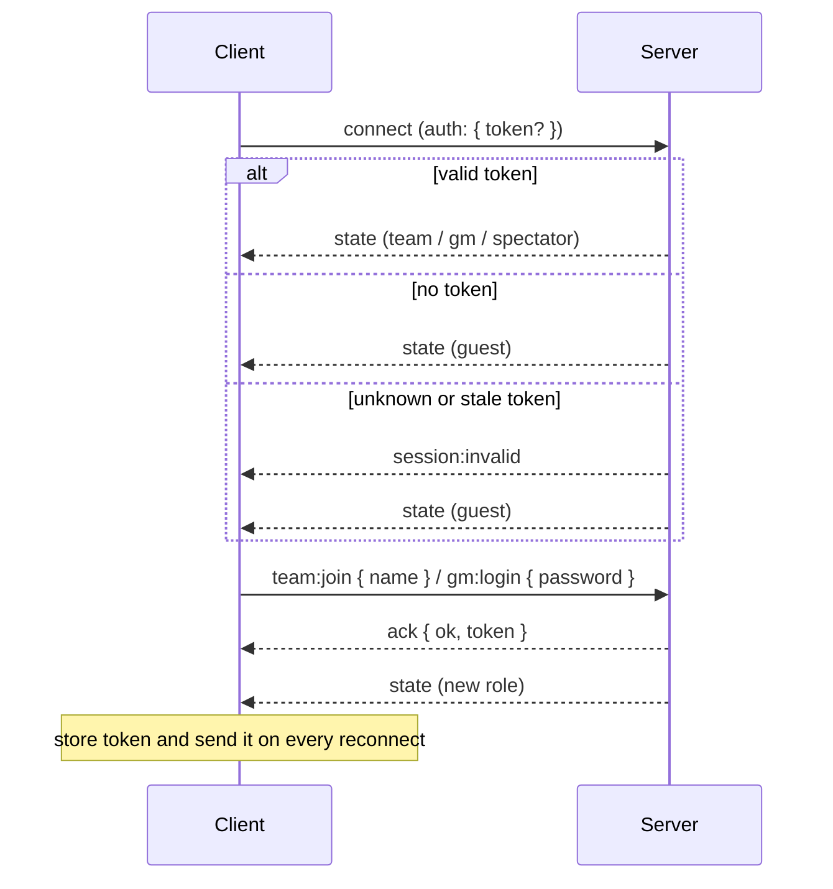

# Socket protocol

This is the reference for everything the clients and the server say to each other over Socket.IO. The server code is in [`server/src/net/`](../server/src/net), and the client helper is [`client/src/net/game.js`](../client/src/net/game.js).

- [Principles](#principles)
- [Connecting and sessions](#connecting-and-sessions)
- [Roles and what they see](#roles-and-what-they-see)
- [Requests (client → server)](#requests-client--server)
- [Server events (server → client)](#server-events-server--client)
- [State payloads](#state-payloads)
- [Errors](#errors)
- [Client usage](#client-usage)

---

## Principles

- **The server decides everything.** Clients send *requests*; the server checks each one, applies it, and replies.
- **Every request gets an ack**, which is always either `{ ok: true, ...data }` or `{ ok: false, error: { code, message } }`.
- **Full snapshots, not diffs.** After every successful request, the server sends each connected client a complete `state` payload filtered for its role. Treat each `state` as a full replacement; with ~10 teams this is cheap and keeps clients simple.
- **Roles are checked on the server** for every request. Hiding buttons in the UI is never the security boundary.
- **Session tokens never appear in state payloads.** A client receives its token exactly once, in the ack of its join or login.

---

## Connecting and sessions



- **Same origin.** In production, Express serves the client; in development, Vite forwards `/socket.io` to the game server. The server has no CORS configuration.
- **Handshake auth.** Pass `auth: { token }`. With socket.io-client, use the callback form `auth: (cb) => cb({ token })` so every automatic reconnect sends the latest stored token.
- **Tokens** are random 192-bit strings, kept only in server memory. After a server restart every token is invalid: teams can't rejoin a match that no longer exists, and the GM and spectator sign in again. Keeping sessions across a crash is planned for step 9.
- **Multiple tabs or devices** can share one team token. They all receive the same team state.
- **A team session ends** when the team leaves (lobby only), the GM removes it (lobby only), or the GM resets without keeping teams. The socket gets `session:ended` and becomes a guest.

### Passwords

- The GM password and the spectator password are set in `.env` (`GM_PASSWORD`, `SPECTATOR_PASSWORD`). The server refuses to start without them.
- Passwords are compared in constant time.
- **Lockout:** after 5 wrong passwords from the same client address, that role's login is locked for 60 seconds (`too_many_attempts`). The GM and spectator logins are counted separately.

---

## Roles and what they see

| Role | Becomes one by | Sees |
|---|---|---|
| `guest` | connecting without a valid token | match status, names and colors of joined teams, whether joining is open |
| `team` | `team:join` | **its own full state** (budget, staff, focus, stats, active effects, decisions, private event log, history, this round's forecast; never a season score) · other teams' **name, color and location only** · the public feed |
| `spectator` | `spectator:login` (password) | match status, team names/colors/locations, the public feed |
| `gm` | `gm:login` (password) | everything: the full match, including flags, scheduled follow-ups, every team's log, online counts and event definitions |

**Public for everyone:** the **feed** of social-media snippets, which events publish through their `post` field (see [EVENTS.md → Public posts](EVENTS.md#public-posts)), the competition steps the GM has announced, and final **standings** once the competition's podium has been shown.

**Never sent to teams or spectators:** other teams' numbers, event details (titles, texts, effects), flags, scheduled follow-ups, the event `source`, tokens.

These rules are implemented in [`views.js`](../server/src/net/views.js), and the integration tests check that nothing leaks.

---

## Requests (client → server)

Send with `socket.emitWithAck(event, payload)`. Every payload is an object; use `{}` when a request takes no arguments.

### Anyone

| Event | Payload | Ack data | Notes |
|---|---|---|---|
| `state:request` | `{}` | `{}` | Sends a fresh `state` to this socket only. Use it after a reconnect if you want to be sure you're up to date. |
| `session:logout` | `{}` | `{}` | GM/spectator: revokes the token and becomes a guest. Guests: no-op. Teams: `forbidden` (use `team:leave`). |

### Guests only

Signed-in sockets get `already_authenticated`.

| Event | Payload | Ack data | Errors |
|---|---|---|---|
| `team:join` | `{ name: string }` | `{ token, teamId }` | `invalid_name` (empty), `name_taken` (case-insensitive), `not_lobby` (no late joins), `match_full` |
| `gm:login` | `{ password: string }` | `{ token }` | `invalid_password`, `too_many_attempts` |
| `spectator:login` | `{ password: string }` | `{ token }` | `invalid_password`, `too_many_attempts` |

Team names are trimmed, repeated spaces are collapsed, and names are cut to 24 characters.

### Teams only

| Event | Payload | Errors |
|---|---|---|
| `team:leave` | `{}` | `not_lobby` |
| `team:allocate` | `{ personnel: { aero, chassis, powertrain, electronics, business, driverless } }` | `decisions_closed`, `invalid_allocation` (all departments, whole numbers ≥ 0, same team size), `needs_autonomous` (driverless staff without the programme) |
| `team:focus` | `{ performance: 0–100 }` | `decisions_closed`, `invalid_focus` |
| `team:answer` | `{ instanceId, optionId }` | `decisions_closed`, `unknown_decision`, `unknown_option`, `option_unavailable` |
| `team:setAutonomous` | `{ enabled: boolean }` | `decisions_closed`, `cannot_afford` (setup fee), `driverless_staffed` (move them out before stopping). Starting charges the fee and unlocks the driverless department and the autonomy stat. |

Decisions are open in the lobby and during the decision phase. They're closed while paused, during resolution, and after the match ends.

### Game Master only

| Event | Payload | Ack data | Errors |
|---|---|---|---|
| `gm:configure` | `{ totalRounds?, decisionSeconds?, resolutionSeconds? }` (whole numbers) | `{ config }` | `not_lobby`, `invalid_config` (limits: rounds 1–30, decision 10–600 s, results 3–120 s) |
| `gm:start` | `{}` | | `not_lobby`, `no_teams`. Starts round 1's decision timer. |
| `gm:pause` | `{}` | | `not_running`. Works in both phases; the time left is kept. |
| `gm:resume` | `{}` | | `not_paused` |
| `gm:advance` | `{}` | | `not_running`. Ends the current phase now: decision → resolve the round; results → next round, or the end after the last round. Also resumes a paused match. |
| `gm:addTime` | `{ seconds }` (whole number, −600…600, not 0) | | `invalid_seconds`, `not_running`. Moves the current phase's end; never leaves less than 1 s. Works while paused. |
| `gm:end` | `{}` | | Ends the season immediately; the competition can be started next. |
| `gm:reset` | `{ keepTeams?: boolean }` (default `true`) | | Back to the lobby with the same settings. Without teams, every team session ends (`session:ended`, reason `reset`). |
| `gm:removeTeam` | `{ teamId }` | | `not_lobby`, `unknown_team` |
| `gm:trigger` | `{ eventId, teamIds?: string[], respectConditions?: boolean }` | `{ results: [{ teamId, changes, decisionId }] }` | `match_ended`, `unknown_event`, `teams_required` (team events need `teamIds`), `no_matching_teams`, `unknown_team` |
| `gm:reloadEvents` | `{}` | `{ reload: { ok, count, errors, warnings } }` | A failed reload returns `ok: false` in the data and keeps the previous definitions. |
| `gm:patchTeam` | `{ teamId, budget }` (whole number, \|budget\| ≤ 10,000,000) | `{ changes }` | `unknown_team`, `invalid_patch` (only the budget can be edited), `match_ended`. The change is written to that team's log, so the team sees it happened. |
| `gm:post` | `{ text }` (≤ 280 chars) | `{ post }` | `invalid_post` (empty). Publishes to the public feed as "Race Control" (`teamId: null`, `source: 'gm'`). |
| `gm:explain` | `{ eventId }` | `{ teams: [{ teamId, eligible, reasons }] }` | `unknown_event`. Read-only: says why an event would or wouldn't fire by itself for each team. |
| `gm:startRace` | `{}` | `{ steps }` | `not_ended` (the season has to finish first), `race_started`, `no_teams`. Computes the whole competition from the final state. |
| `gm:raceAdvance` | `{}` | `{ step }` | `no_race`. Announces the next step; on the last one the competition is `finished`. |
| `gm:raceBack` | `{}` | `{ step }` | `no_race`. Steps back, e.g. after clicking too fast. |

### Phase changes

Phase changes happen on the server's own timer, not because of a request. Each change is pushed as a normal `state` update to every client. See [GAME_RULES.md → Match structure](GAME_RULES.md#match-structure).

---

## Server events (server → client)

| Event | Payload | When |
|---|---|---|
| `state` | role-specific snapshot, see below | on connect, after every successful request by anyone, on connect/disconnect (GM online counts), after an event reload |
| `session:invalid` | none | the handshake token is unknown or its team no longer exists. Delete the stored token. |
| `session:ended` | `{ reason: 'left' \| 'removed' \| 'reset' }` | this socket's team session ended. It's now a guest; delete the stored token. |

---

## State payloads

Every payload has `role` and `serverTime` (the server's clock in epoch ms when the payload was built).

### Countdowns

The server doesn't send a tick every second. Clients count down locally:

```js
const offset = state.serverTime - Date.now();                          // once per state payload
const msLeft = match.status === 'paused'
  ? match.pausedRemainingMs                                             // frozen while paused
  : Math.max(0, match.phaseEndsAt - (Date.now() + offset));              // re-render every ~250 ms
```

Using `serverTime` means a phone with a wrong clock still shows the right time. `phaseEndsAt` is `null` in the lobby and after the end. `useCountdown(match, serverTime)` in `client/src/components/common.jsx` does exactly this.

### Shared shapes

```js
MatchInfo = {
  id, status,            // 'lobby' | 'running' | 'paused' | 'ended'
  phase,                 // 'lobby' | 'decision' | 'resolution' | 'ended'
  round, totalRounds, decisionSeconds, resolutionSeconds, maxTeams,
  phaseEndsAt,           // epoch ms or null
  pausedRemainingMs,     // ms or null
}
PublicTeam = { id, name, color, location: { id, name, country, costLevel, sponsorLevel } }
FeedPost   = { id, round, teamId, eventId, source, text }    // last 50; source 'event' | 'gm'
                                                             // GM announcements have teamId: null
Standing   = { place, teamId, name, color, score, source, performance, reliability, budget }
             // source: 'season' (GM only, before the competition finishes) or 'race' (score = race points)
Race       = {
  status,            // 'revealing' | 'finished'
  step, totalSteps,  // how far the GM has announced
  disciplines: [{ id, name, type, points, unit, blurb }],
  steps: [...],      // only the announced ones for teams and the spectator; all of them for the GM
  totals: [{ place, teamId, total, byDiscipline }] | null,   // null until it's finished (GM: always)
}
```

### The competition

`race` is `null` until the GM starts it. Each step carries `kind`, `title`, `subtitle` and its own payload:

| `kind` | Payload |
|---|---|
| `intro` | — |
| `static-preliminary` | `rows` (everyone outside the top 4, with `score` and `points`), `finalistIds` |
| `static-finals` | `rows` (the finalists with `finalScore`), `standings` (the whole discipline) |
| `timed`, `efficiency` | `rows`: `{ teamId, status, time, points }`; `status` `finished` / `not-entered` (no driverless car) / `no-time` |
| `endurance-lap` | `lap`, `totalLaps`, `order` (timing board), `retirements`: `{ teamId, lap, reason }`, `fastestLap`: `{ teamId, time, lap }` (race so far). `order` entries: `{ teamId, status, laps, total, gap, lastLap, bestLap }`; running cars first by `total`, `gap` in seconds behind the leader (0 for the leader, `null` once retired), times in seconds |
| `endurance-result` | `rows`: `{ teamId, status, time, bestLap, laps, dnfLap, reason, points }` (`time` = total seconds), `fastestLap` |
| `totals` | `rows`: `{ place, teamId, total, byDiscipline }` |
| `podium` | `rows`: the top three |

**Teams and the spectator screen only receive the announced steps** (`steps.slice(0, step + 1)`) and no totals until the podium, so nothing can be read ahead in the browser. The GM receives the full timeline to prepare.

### `guest`

```js
{ role: 'guest', serverTime, match: MatchInfo,
  teams: [{ id, name, color }],
  joinable }             // lobby and not full
```

### `spectator`

```js
{ role: 'spectator', serverTime, match: MatchInfo,
  teams: PublicTeam[], feed: FeedPost[],
  standings: Standing[] | null }   // null until the competition's podium has been shown
```

### `team`

Everything the spectator gets, plus:

```js
{ role: 'team', ...,
  rules: {                          // static; what the team needs to plan
    departments: [{ id, label, description }],   // what they produce is in me.projection.departments
    economy: { baseIncome, sponsorshipPerOutput, costPerMember },
    focusMultiplier: { min, max },
    statLimits: { performance: { min, max }, reliability: { min, max }, autonomy: { min, max } },
    autonomous: { setupCost, perRoundCost, incomeMultiplier, autonomyPerDriverless, autonomyPerElectronics },
  },
  me: {
    id, name, color, location, budget, personnel, headcount, focus, stats,
    autonomous,                     // driverless programme running
    score,                          // null while hidden (see below)
    start: { budget, stats, score },      // values at join, for "change since" displays
    projection: {
      gains: { performance, reliability, autonomy }, income, upkeep, net,
      departments: {                // one entry per department
        [dept]: { members, performance, reliability, autonomy, sponsorship,   // this department's share per round
                  nextPerson: { performance, reliability, autonomy, sponsorship, cost } },  // one more person there
      },
      programmeCost,                // the driverless programme's cost per round for this team (running or not)
    },
    activeEffects: [{ id, label, roundsLeft, perRound: PreviewEffect[], modifiers }],
    decisions: DecisionView[],     // see ARCHITECTURE.md → decisionsView shape
    eventLog: LogEntry[],          // own events only; no `source`, no flag changes
    history: RoundReport[],
  } }
```

- **`projection`** is what this round's production would give with the team's current staff, focus, location and active modifiers, before any random events. It's recalculated on every payload, so a client can show a live forecast without duplicating the rules (diminishing returns, headroom, location levels and season length are all applied on the server). `departments[dept]` values add up to `gains` and `income − baseIncome` (to rounding); `nextPerson` is the marginal value of adding one person to that department, and `nextPerson.cost` what that person costs per round.
- **`score`** follows `VISIBILITY.ownScoreDuringMatch` in `rules.js`, which is `false`: `me.score`, `me.start.score` and every `history[].score` are always `null` for teams, even after the match. Teams get `standings` (competition points) once the podium has been shown.

`DecisionView`, `PreviewEffect`, `LogEntry` and `RoundReport` are described in [ARCHITECTURE.md](ARCHITECTURE.md#decisionsview-shape).

### `gm`

```js
{ role: 'gm', serverTime,
  match: Match,                      // the full match object, see ARCHITECTURE.md → data model
  rules: TeamRules,                  // same block the team gets (department labels etc.)
  scores: { [teamId]: number },      // computed here so the GM screen never redoes the formula
  race: Race | null,                 // the full timeline, including steps not yet announced
  standings: Standing[] | null,      // season standings once the season ends, competition standings once the podium is shown
  loop: { timerArmed, lastError },   // lastError: a phase change that failed and paused the match (until reset)
  online: { teams: { [teamId]: socketCount }, gm, spectators, guests },
  events: { count, errors, warnings, definitions: [{ id, title, scope, weight, enabled, tags, hasDecision }] } }
```

---

## Errors

| Code | Meaning |
|---|---|
| `forbidden` | This role can't send that request. |
| `already_authenticated` | Join or login attempted by a socket that's already signed in. |
| `invalid_password` | Wrong GM or spectator password. |
| `too_many_attempts` | Login locked for this client for 60 s. |
| `invalid_name`, `name_taken` | Team name problems. |
| `not_lobby`, `match_full`, `no_teams`, `not_running`, `not_paused`, `match_ended` | Lifecycle rules. |
| `invalid_config`, `invalid_seconds` | GM settings or time change out of range. |
| `invalid_patch`, `invalid_post` | GM team edit or announcement rejected. |
| `cannot_afford`, `driverless_staffed` | Driverless programme can't start or stop right now. |
| `not_ended`, `race_started`, `no_race` | Competition requests out of order. |
| `decisions_closed`, `invalid_allocation`, `invalid_focus` | Team input rules. |
| `unknown_team`, `unknown_event`, `unknown_decision`, `unknown_option` | Bad ids. |
| `option_unavailable` | Option `requires` not met; the message says what's needed. |
| `teams_required`, `no_matching_teams` | GM trigger targeting. |
| `internal` | Unexpected server error (logged on the server). |
| `timeout` | Client-side only: no ack within 8 s (`client/src/net/game.js`). |

---

## Client usage

```jsx
import { useGame } from '../net/game.js';

function TeamScreen() {
  const { connected, state, notice, request } = useGame('team');   // 'team' | 'gm' | 'spectator'

  async function join(name) {
    try {
      await request('team:join', { name });   // token is stored automatically
    } catch (err) {
      showError(err.message);                 // err.code is one of the codes above
    }
  }

  if (state?.role === 'guest') return <JoinForm onSubmit={join} />;
  if (state?.role === 'team') return <Dashboard me={state.me} feed={state.feed} />;
}
```

- `useGame(view)` opens one socket per view per page load and stores that view's token in `localStorage` (`eforce.token.team`, `eforce.token.gm`, `eforce.token.spectator`).
- It clears the stored token on `session:invalid`, on `session:ended` and after `session:logout`.
- `notice` holds a human-readable reason after the GM removed or reset the team.

For a headless client (tests, the step 8 load test), see [`server/test/sockets.test.js`](../server/test/sockets.test.js).
